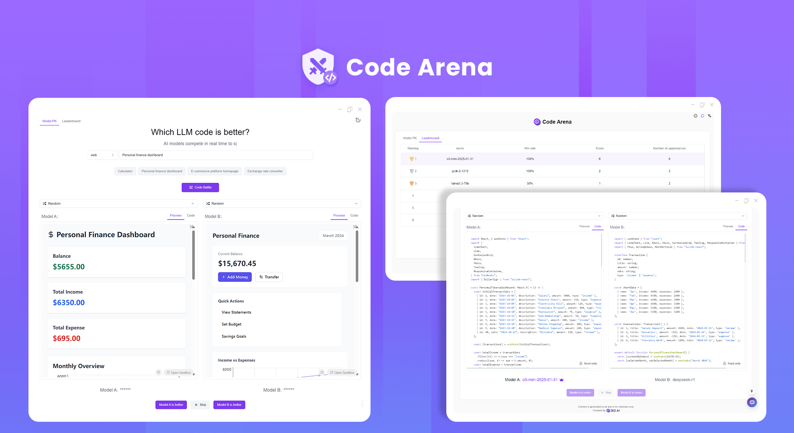
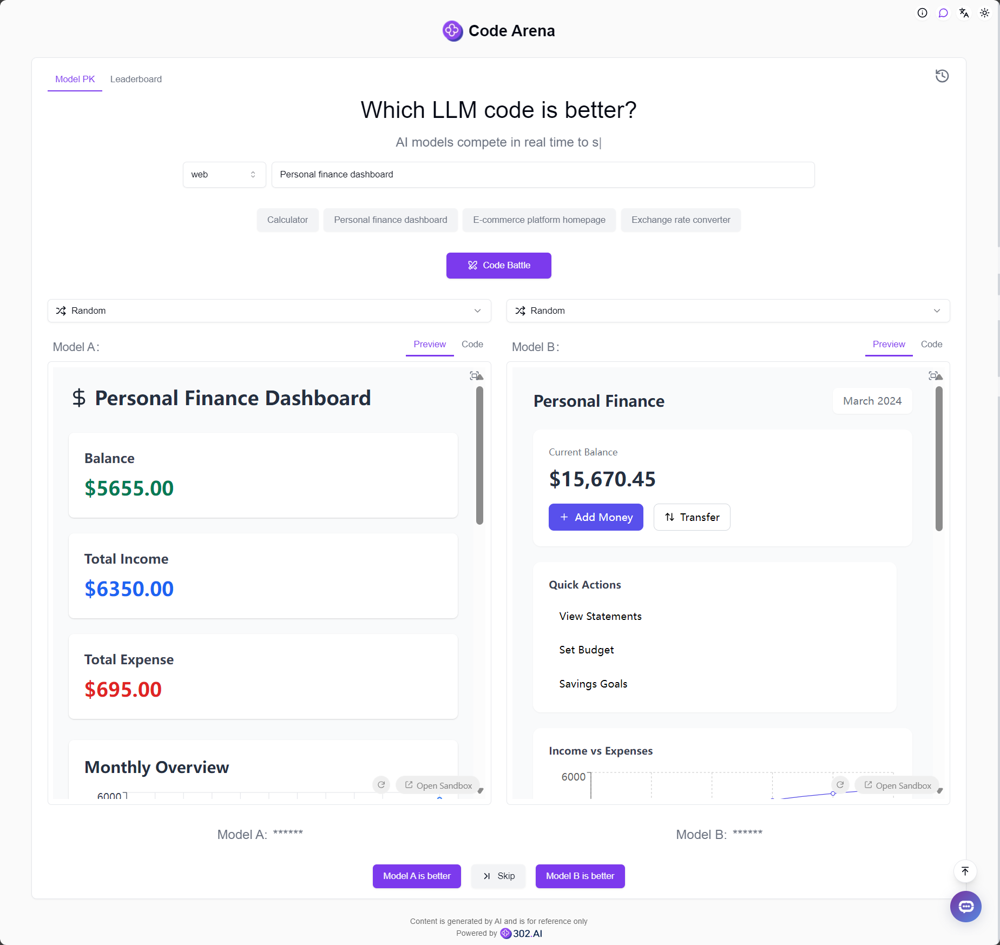
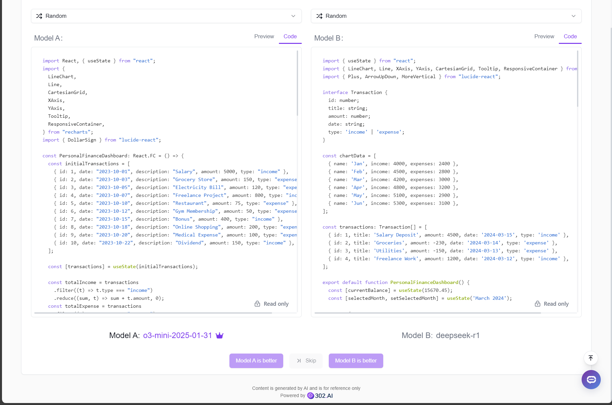
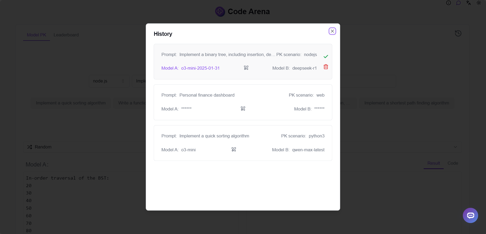
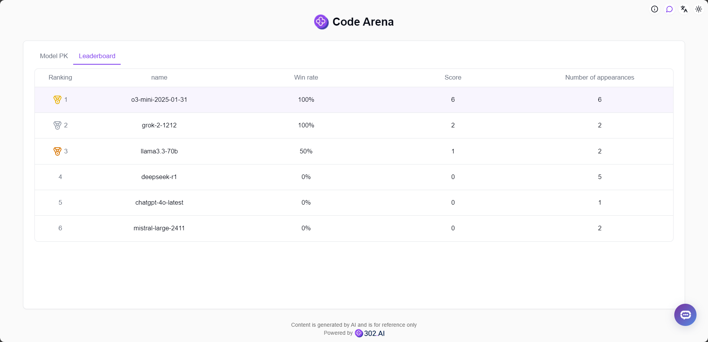

# 
 🖥️ Code Arena 🚀✨

Code Arena allows you to randomly or manually select two AI models to generate code simultaneously, vote for the model with better results, and generate personal rankings based on voting results.

<a href="README_zh.md">中文</a> | <a href="README.md">English</a> | <a href="README_ja.md">日本語</a>

This is the open-source version of the [Code Arena](https://302.ai/en/tools/codearena/) from [302.AI](https://302.ai/en/). You can directly log in to 302.AI to use the online version with zero code and zero background, or modify and deploy it yourself according to your requirements.

## Interface Preview
In the model battle, multiple programming languages such as web and Python are available. Based on your input description, you can randomly select or manually choose two models for a real-time code duel to see which one has superior coding capabilities.

You can see the code and its preview effects, and vote for the model with better results.

The generated code and voting results are saved in the history.

Based on user voting results, the system automatically generates personal model rankings to help you find the most suitable AI model for code generation.

## Project Features
### 💻 Multi-language Code Support
Supports code generation in multiple programming languages.
### 🤖 AI Model Battles
Supports simultaneous code generation and comparison between two AI models.
### 📊 Ranking System
Generates personal model rankings based on user votes.
### 💾 History Records
Complete preservation of all code generation records and voting results.
### 🌍 Multi-language Support
- Chinese Interface
- English Interface
- Japanese Interface

## 🚩 Future Update Plans
- [ ] Support for more programming languages
- [ ] Support for more AI code generation models

## 🛠️ Tech Stack
- React
- Tailwind CSS
- Shadcn UI

## Development & Deployment
1. Clone project `git clone https://github.com/302ai/302_code_arena`
2. Install dependencies `npm`
3. Configure 302's API KEY (refer to .env.example)
4. Run project `npm run dev`
5. Build and deploy `docker build -t 302_code_arena . && docker run -p 3000:80 302_code_arena`
6. Node version 20 or above required

## ✨ About 302.AI ✨
[302.AI](https://302.ai/en/) is an enterprise-oriented AI application platform that offers pay-as-you-go services, ready-to-use solutions, and an open-source ecosystem.✨
1. 🧠 Comprehensive AI capabilities: Incorporates the latest in language, image, audio, and video models from leading AI brands.
2. 🚀 Advanced application development: We build genuine AI products, not just simple chatbots.
3. 💰 No monthly fees: All features are pay-per-use, fully accessible, ensuring low entry barriers with high potential.
4. 🛠 Powerful admin dashboard: Designed for teams and SMEs - managed by one, used by many.
5. 🔗 API access for all AI features: All tools are open-source and customizable (in progress).
6. 💡 Powerful development team: Launching 2-3 new applications weekly with daily product updates. Interested developers are welcome to contact us.