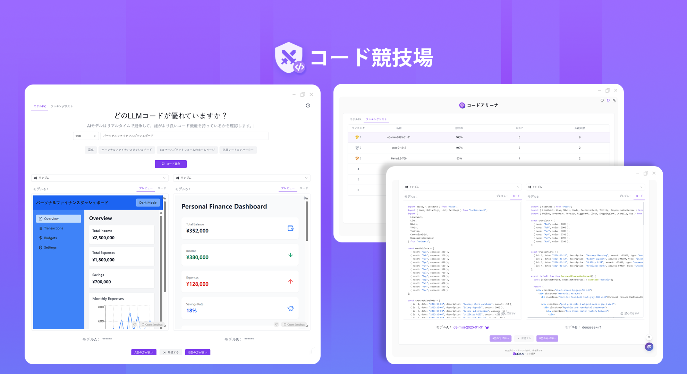
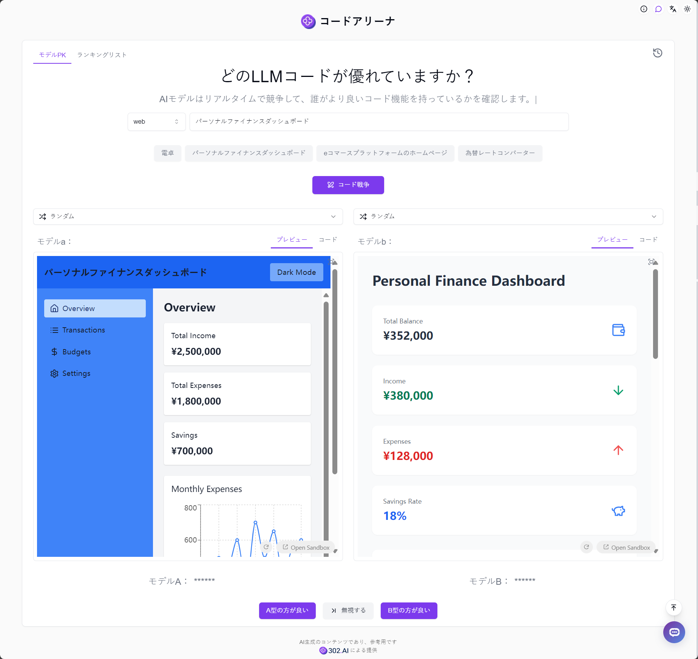
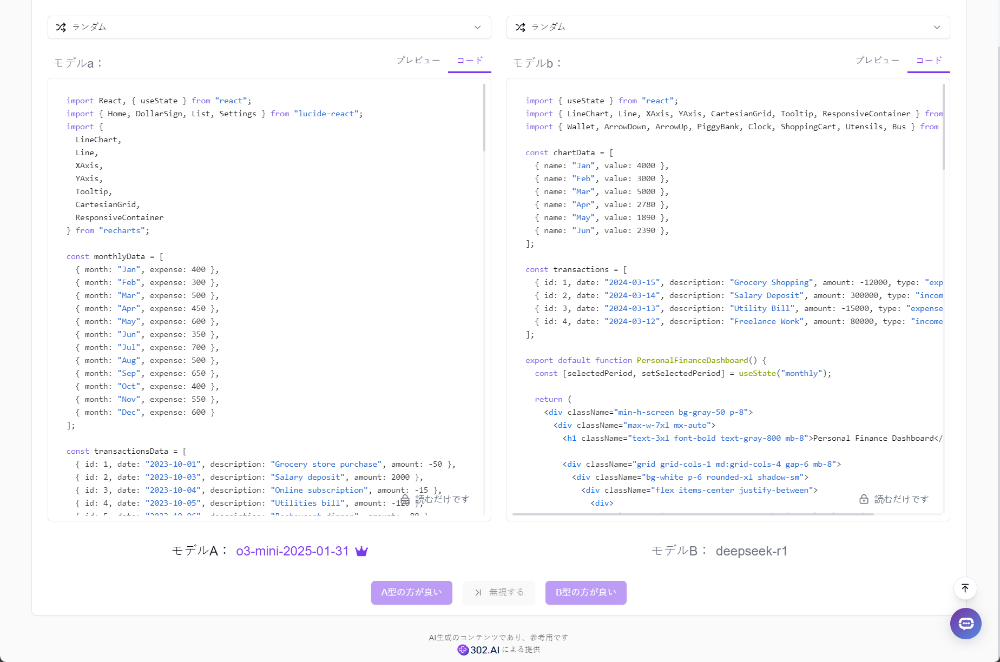
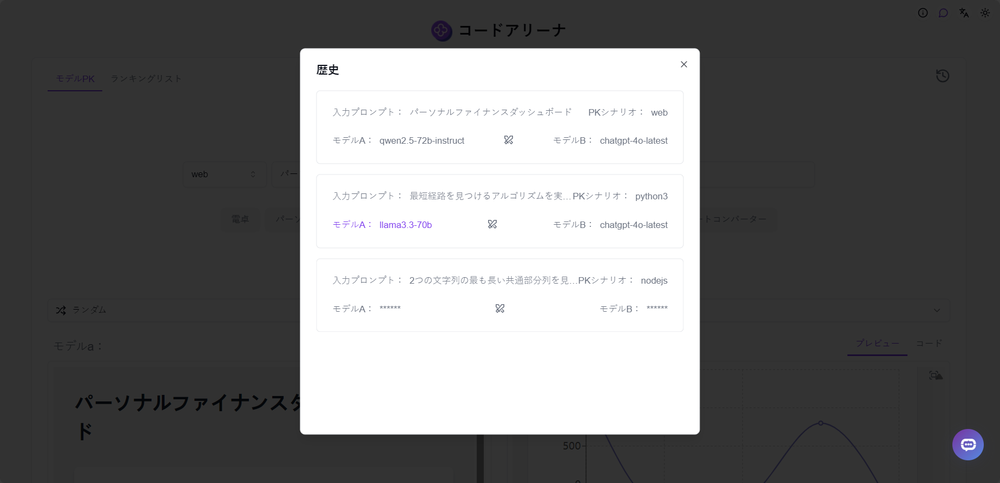
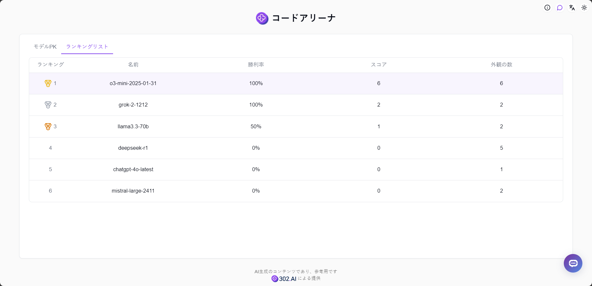

# 
 🖥️ コード競技場 🚀✨

コード競技場では、ランダムまたは手動で2つのAIモデルを選択して同時にコードを生成し、より良い結果のモデルに投票し、投票結果に基づいて個人ランキングを生成することができます。

<a href="README_zh.md">中文</a> | <a href="README.md">English</a> | <a href="README_ja.md">日本語</a>

[302.AI](https://302.ai/ja/)の[コード競技場](https://302.ai/product/detail/59)のオープンソース版です。
302.AIに直接ログインすることで、コード不要、設定不要のオンライン体験が可能です。
あるいは、このプロジェクトをニーズに合わせてカスタマイズし、302.AIのAPI KEYを統合して、自身でデプロイすることもできます。

## インターフェースプレビュー
モデル対決では、web、pythonなど複数のプログラミング言語から選択でき、入力された説明に基づいてランダムまたは手動で2つのモデルをリアルタイムでコード対決させ、どちらのコーディング能力が優れているかを確認できます。

コードとその対応するプレビュー効果を確認し、より良い結果のモデルに投票することができます。

生成されたコードと投票結果は履歴に保存されます。

ユーザーの投票結果に基づいて、システムは自動的に個人モデルランキングを生成し、コード生成に最適なAIモデルを見つけるのに役立ちます。

## プロジェクトの特徴
### 💻 マルチ言語コードサポート
複数のプログラミング言語でのコード生成をサポート。
### 🤖 AIモデル対決
2つのAIモデルによる同時コード生成と比較をサポート。
### 📊 ランキングシステム
ユーザー投票に基づく個人モデルランキングの生成。
### 💾 履歴記録
すべてのコード生成記録と投票結果を完全に保存。
### 🌍 多言語サポート
- 中国語インターフェース
- 英語インターフェース
- 日本語インターフェース

## 🚩 将来のアップデート計画
- [ ] より多くのプログラミング言語のサポート
- [ ] より多くのAIコード生成モデルのサポート

## 🛠️ 技術スタック
- React
- Tailwind CSS
- Shadcn UI

## 開発とデプロイ
1. プロジェクトのクローン `git clone https://github.com/302ai/302_code_arena`
2. 依存関係のインストール `npm`
3. 302のAPI KEYを設定 (.env.exampleを参照)
4. プロジェクトの実行 `npm run dev`
5. ビルドとデプロイ `docker build -t 302_code_arena . && docker run -p 3000:80 302_code_arena`
6. Node バージョン20以上が必要

## ✨ 302.AIについて ✨
[302.AI](https://302.ai/ja/)は企業向けのAIアプリケーションプラットフォームであり、必要に応じて支払い、すぐに使用できるオープンソースのエコシステムです。✨
1. 🧠 包括的なAI機能：主要AIブランドの最新の言語、画像、音声、ビデオモデルを統合。
2. 🚀 高度なアプリケーション開発：単なるシンプルなチャットボットではなく、本格的なAI製品を構築。
3. 💰 月額料金なし：すべての機能が従量制で、完全にアクセス可能。低い参入障壁と高い可能性を確保。
4. 🛠 強力な管理ダッシュボード：チームやSME向けに設計 - 一人で管理し、多くの人が使用可能。
5. 🔗 すべてのAI機能へのAPIアクセス：すべてのツールはオープンソースでカスタマイズ可能（進行中）。
6. 💪 強力な開発チーム：大規模で高度なスキルを持つ開発者集団。毎週2-3の新しいアプリケーションをリリースし、毎日製品更新を行っています。才能ある開発者の参加を歓迎します。
